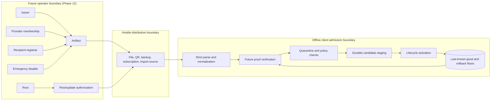

<!-- SPDX-License-Identifier: CC-BY-SA-4.0 -->
<!-- Copyright 2026 Saro -->

# KIP-0076: Phase 8 Profile Threat Model and Artifact Classes

## Status and authority

- status: requirements-lock
- last_verified: 2026-07-17
- scope: WO-801 trust semantics and contract-only metadata
- parent authorization: KIP-0075

This KIP freezes trust semantics only. Authenticated, signed, and sealed describe
properties required of later Phase 8 work orders, not the current metadata-only
implementation. This KIP selects no algorithm, dependency, wire encoding, real
key, service, or network protocol.

## Actors, assets, attacker, and trust boundaries

Protected assets are profile content and lineage; generation, root, and
revocation floors; recipient membership; recipient capabilities; issuer and
emergency authority; recipient scope and enrollment epochs; last-known-good state; and privacy-sensitive routing
metadata. An attacker may create, copy, reorder, replay, truncate, replace, or
withhold artifacts; control an import source or backup; observe metadata and
artifact size; compromise one non-root role; alter wall clock; restore old local
files; or show different views to clients. The attacker is not assumed to hold
every uncompromised authority capability, break the later selected construction,
or control an intact platform secure-storage boundary. A fully compromised,
unlocked device is outside Phase 8 guarantees. Go memory zeroization is not
guaranteed.

Distribution is untrusted and parsing grants no authority. Verification, policy
validation, durable staging, and activation are distinct seams. Rejection or
interruption leaves last-known-good state unchanged.

## Exactly scoped authority roles

| Role | Sole authority | Explicit non-authority | Compromise blast radius |
|---|---|---|---|
| Root | Authorize the active root set/epoch and scoped issuer delegations | Cannot sign ordinary profiles, enroll recipients, operate relays, release apps, disable service, or decrypt content | Root evolution and issuer delegation from the compromised epoch until separately trusted recovery |
| Issuer | Authenticate snapshots in an assigned provider/lineage scope | Cannot change roots, recipient membership, app releases, relays, or emergency state | Assigned issuer scope only |
| Provider | Authorize provider/group recipient membership | Cannot issue profile content, roots, relays, app releases, or emergency controls | Membership and confidentiality of that group |
| Recipient registrar | Authorize enrollment, rotation, and revocation of device-recipient and backup-recipient capabilities in one assigned provider/lineage scope at a monotonically increasing recipient epoch | Cannot issue profiles, change roots, authorize groups, decrypt artifacts, recover lost capabilities, operate relays, release apps, or exercise emergency controls | Device/backup recipient availability and confidentiality within the assigned provider/lineage scope and affected recipient epochs |
| Relay | Authenticate relay descriptors in admitted profile scope | Cannot issue profiles, roots, recipients, app releases, or lifecycle controls | Delegated relay descriptors only |
| App-release | Authenticate client release identity and compatibility | Cannot issue profiles, roots, recipients, relays, or emergency controls | Delegated client releases only |
| Device | Possess one provisioned device-recipient capability | Cannot issue artifacts, enroll others, change roots, or recover another device | Artifacts addressed to that capability |
| Backup | Possess one provisioned backup-recipient capability | Cannot issue profiles, enroll devices/groups, change roots, or recover without it | Backups addressed to that capability |
| Update | Authorize ordered full-snapshot transitions in delegated lineage | Cannot sign content, change roots alone, enroll recipients, or disable service | Ordering and replacement/removal in delegated lineage |
| Emergency-disable | Disable only an explicitly named scope at a newer epoch | Cannot enable, issue, replace, migrate, enroll, decrypt, or lower floors | Availability of the named scope only |
| Operator | Execute and record an approved ceremony | Has no authority merely by role title and cannot bypass capability checks | Ceremonies and credentials actually accessible to that operator |

Possession of one role never implies another role.

## Frozen artifact classes

| Class | Recipient provisioning | Transfer and activation | Recovery | Visible metadata | Confidentiality limit |
|---|---|---|---|---|---|
| `signed-public` | None; any client with an admitted root/issuer view may verify | Untrusted media permitted; normalize, verify, quarantine, stage, then activate | Re-fetch or restore the authenticated snapshot | Minimal class, version, bounded lineage/routing data, epochs, and size | Authenticity/integrity only; content is public |
| `provider-group-recipient` | Provider enrolls a concrete group capability under a nonzero recipient epoch whose meaning is group-membership revision | Only a provisioned group recipient opens it; inner artifact still verifies separately | Authorized re-enrollment and reissuance at a newer recipient epoch | Rotating opaque group hint plus necessary class/version/size and recipient-epoch data | No secrecy from group members, compromised endpoints, issuer, size analysis, or repeated-issuance correlation |
| `device-recipient` | Recipient registrar enrolls one concrete device capability under an assigned provider/lineage scope and nonzero recipient epoch; Phase 9 owns protected storage and UX | Only that capability opens it, followed by inner verification | No Phase 8 automatic recovery; registrar may authorize replacement enrollment and reissuance but cannot recover the lost capability or decrypt prior artifacts | Rotating opaque device hint plus necessary class/version/size, provider/lineage scope, and recipient-epoch data | No device anonymity, unlinkability, compromised-device protection, or key-loss recovery claim |
| `encrypted-backup` | Recipient registrar enrolls one concrete backup-recipient capability under an assigned provider/lineage scope and nonzero recipient epoch before export | Recipient-key-sealed only; verify inner artifact and preview before restore | Capability possession required; loss is unrecoverable in Phase 8; registrar may authorize a new capability only for newly issued backups | Rotating opaque backup hint plus necessary class/version/size, provider/lineage scope, and recipient-epoch data | No universal/shared decryption key exists or is permitted; registrar cannot decrypt or recover old backups |

The backup disposition is exactly one option: Phase 8 backups are
recipient-key-sealed only. Passphrase/recovery-key KDF selection, parameters,
wrapping, migration, and UX are deferred to Phase 9/13. Neither later phase may
introduce a universal or shared decryption key.

`RecipientEpoch` is the single authenticated, class-sensitive epoch field.
`signed-public` requires zero because it has no recipient provisioning state;
all three recipient classes require nonzero. For a provider group it identifies
the group-membership revision. For device and backup recipients it identifies
the registrar enrollment revision within the assigned provider/lineage scope.
WO-801 rejects a changed epoch as a conflicting equal-generation identity. It
does not yet persist a cross-generation minimum or claim rollback detection
after restore, reinstall, or device replacement; Phase 9 owns protected local
floors and later admission work must compare this authenticated epoch with them.

## Recipient metadata privacy and misuse matrix

Hints are bounded opaque lookup values, rotate on membership change, and should
rotate on reissuance. They are not stable device IDs or hashes of such IDs.
Collisions fail as ambiguous; implementations must not try every recipient key.
Enumeration reveals no recipient secret or membership answer beyond artifacts
already visible. Lookup work and candidate count must be bounded.

| Misuse | Negative behavior | Residual limit |
|---|---|---|
| Stable ID, HWID, account name, or deterministic derivative as hint | Prohibited; reject at provisioning/review | Client-side opaqueness cannot prove an operator's derivation method |
| Hint collision | Quarantine as ambiguous | Collision can deny availability |
| Unknown or duplicate routing metadata | Reject before authority interpretation | Source and artifact size remain visible |
| Wrong audience or recipient | Reject without class fallback | Recipient compromise exposes its authorized artifacts |
| Wrong provider/lineage scope or conflicting equal-generation recipient epoch | Reject before opening; no cross-scope or epoch fallback | Cross-generation rollback rejection depends on a later protected local floor |
| Locally observed hint reuse | Require rotation before replacement | A fresh install cannot detect older reuse |
| Oversized hint or recipient set | Reject before key-provider work | Bounds do not hide artifact count or size |

Group size, ciphertext size, timing, provider grouping, and repeated issuance can
correlate recipients. No anonymity-set size, unlinkability, or traffic-analysis
resistance is claimed.

## Full-snapshot lineage and activation

Phase 8 admits full snapshots only. WO-801 binds all security-relevant fields
currently exposed by `profile.Candidate`: profile and revocation identity,
contract compatibility, generation and safety floor, validity interval, authority
evidence, and envelope identity. It also binds artifact class/audience, content
ID, lineage ID, provider ID, root epoch, revocation epoch, and update/predecessor
semantics. The future canonical profile schema in WO-803 owns complete relay and
strategy membership, canonical member ordering, duplicate-member rejection, and
the content ID derived from that complete snapshot. Until then WO-801 makes no
claim that relay/strategy membership is represented or verified. Replacement and
removal name the previous content ID; deltas and implicit omission remain
prohibited. Provider migration additionally names a distinct previous provider
and requires authorization under the root/update policy.

Equal generation is idempotent only when all authenticated identity, epoch,
class, audience, and predecessor fields are identical. Otherwise it is a
conflict. Unknown critical metadata, partial snapshots, conflicts, or failed
verification remain quarantined. Durable staging must complete before atomic
lifecycle activation; failure preserves last-known-good state.

## Root evolution, rollback, and conflicting views

Root sets have a nonzero epoch. A full-set root replacement must be authorized
by the currently admitted root policy and advance the epoch. A newly added root
alone cannot authorize its own admission.

| Root misuse | Negative behavior | Recovery and residual limit |
|---|---|---|
| Lower epoch | Reject and retain last-known-good | Requires an intact durable floor |
| Same epoch, different set | Quarantine as conflict | Fresh clients cannot detect a preexisting split |
| Update signed only by new root | Reject | Recovery needs authority trusted by prior policy |
| Unauthorized add/remove | Reject | Compromise satisfying current policy can authorize malicious evolution |
| Different distribution views | Detect only if views meet at one client/history | Isolated clients may remain split |
| Last trusted root lost | Fail closed | No universal recovery or operator override exists |

Transparency and witnessing are deferred to Phase 12/13. Phase 8 therefore
cannot guarantee global split-view detection.

Rollback limits by event:

- **Reboot:** persisted generation/root/revocation floors can reject older state;
  volatile monotonic time cannot.
- **Wall-clock rollback:** generations and epochs remain ordered, but trustworthy
  time policy is deferred. Clock rollback never permits a lower generation.
- **Backup restore:** compare restored state with durable floors when available.
  Restoring both state and its only floor can reintroduce an old view.
- **Reinstall:** app-local floors may disappear, so rollback detection is not
  guaranteed without protected or witnessed state.
- **Device replacement:** no local history exists; fresh recipient provisioning
  and trusted current-state bootstrap are required, without historical rollback
  or split-view guarantees.

`elapsedRealtime` is not claimed to solve reboot, restore, reinstall, or device
replacement rollback.

## STRIDE threat catalog

| # | Named attack | STRIDE | Preventive | Detective | Recovery |
|---|---|---|---|---|---|
| 1 | Forged issuer snapshot | S/T | Required artifact authentication and issuer scope | Verification negatives | Quarantine; retain last-known-good |
| 2 | Role-confusion laundering | S/E | Single-scope roles and non-authority rules | Cross-role negatives | Revoke delegated role; retain safe state |
| 3 | Artifact-class downgrade | T/I | Authenticated class/audience binding | Mismatch tests | Quarantine and reissue |
| 4 | Wrong-recipient substitution | S/I | Concrete recipient binding | Open failure without fallback | Re-enroll/reissue |
| 4a | Stale or cross-scope recipient authorization | S/T/E | Scoped recipient binding and authenticated recipient epoch | Scope/epoch mismatch negatives; WO-801 equal-generation conflict check; later protected-floor comparison | Revoke affected enrollment; authorize a new capability and reissue; never recover the lost capability |
| 5 | Duplicate/unknown metadata ambiguity | T/E | Reject-unknown, exactly-one parsing | Parser negatives | Reject before verification |
| 6 | Equal-generation fork | T/R | Content/lineage identity binding | Same-generation conflict | Quarantine new views |
| 7 | Generation replay | T | Durable generation floor | History comparison | Keep current; fetch newer |
| 8 | Root rollback | S/T/E | Root epoch and prior-policy authorization | Root-history comparison | Retain prior roots |
| 9 | Root split view | T/R | No complete Phase 8 prevention | Detect when views co-locate | Quarantine; later witnessing |
| 10 | Revocation rollback | T/E | Revocation epoch | Durable-floor comparison | Keep scope disabled |
| 11 | Partial snapshot/implicit deletion | T | Full snapshot and canonical membership | Completeness/duplicate checks | Reject entire snapshot |
| 12 | Unauthorized provider migration | S/E | Explicit predecessors and authorization | Migration negatives | Continue prior safe provider |
| 13 | Hint enumeration/collision DoS | I/D | Bounded rotating hints and lookup | Secret-free collision counters | Quarantine; rotate/reissue |
| 14 | Size/reissuance correlation | I | Metadata minimization | Privacy review | Correlation remains residual |
| 15 | Universal backup-key compromise | I/E | Universal/shared keys prohibited | Conformance negatives | Revoke/reissue; past disclosure unrecoverable |
| 16 | Interrupted activation | T/D | Durable staging before activation | Detect incomplete candidate | Discard candidate; keep last-known-good |
| 17 | Wall-clock rollback extends validity | T | Epoch/generation ordering | Clock anomaly when available | Fail closed without trustworthy validity |
| 18 | Emergency-disable overreach | E/D | Disable-only, explicit scope and epoch | Scope/action negatives | Preserve disabled state pending separate authority |

## Security goals and accepted status

The local principle names used below are: **controlled authority** (only an
explicitly authorized role may act on protected state), **least disclosure**
(expose only metadata necessary for the admitted operation), and **bounded blast
radius** (one compromise must not silently acquire another role or unlimited
duration).

1. **Critical, partially met:** unproven or wrong-scope metadata cannot change
   authoritative state. This protects profile, root, revocation, and
   last-known-good assets under controlled authority and bounded blast radius;
   violation causes attacker-controlled policy.
   Structural contracts exist, but proof and durable staging do not.
2. **Critical, not met executably:** one delegated role cannot exercise another
   role. This protects all authority planes under controlled authority and
   bounded blast radius; violation escalates a
   bounded compromise. The rule is frozen but later schema/verifier work must
   enforce it.
3. **High, not met:** sealed content is available only to its provisioned
   audience. This protects private profile/backup content under controlled
   authority and least disclosure; violation
   discloses sensitive configuration. Sealing is not implemented. Public signed
   artifacts are expressly non-confidential.
4. **High, partially met:** locally observable rollback/conflict cannot silently
   replace last-known-good. This protects lineage/floors under bounded blast
   radius; violation can
   reactivate revoked policy. Generation conflict exists, while durable epochs
   and platform persistence remain later work.
5. **Medium, partially met by minimization:** passive observers receive no claim
   that size, grouping, source, or repeated issuance is hidden. This protects
   recipient metadata under least disclosure; violation enables correlation. Stable identifiers
   are prohibited, but size/distribution correlation remains.

## Phase boundaries and non-goals

- Phase 9 owns Android Keystore/KeyMint/StrongBox, encrypted local storage,
  recipient UX, protected floors, restore/reinstall behavior, and any later
  authorized passphrase/recovery UX.
- Phase 11 owns live transport, relay sessions, path execution, and delivery.
- Phase 12 owns operator services, HSM/KMS issuance, enrollment, root ceremonies,
  revocation publication, monitoring, and witnessing. Phase 13 owns release-grade
  recovery, reproducibility, field validation, and readiness evidence.

WO-801 does not select algorithms, define wire bytes, implement cryptography,
add dependencies, create keys, perform networking, promise zeroization, or claim
production readiness, anonymity, undetectability, or guaranteed resistance.
